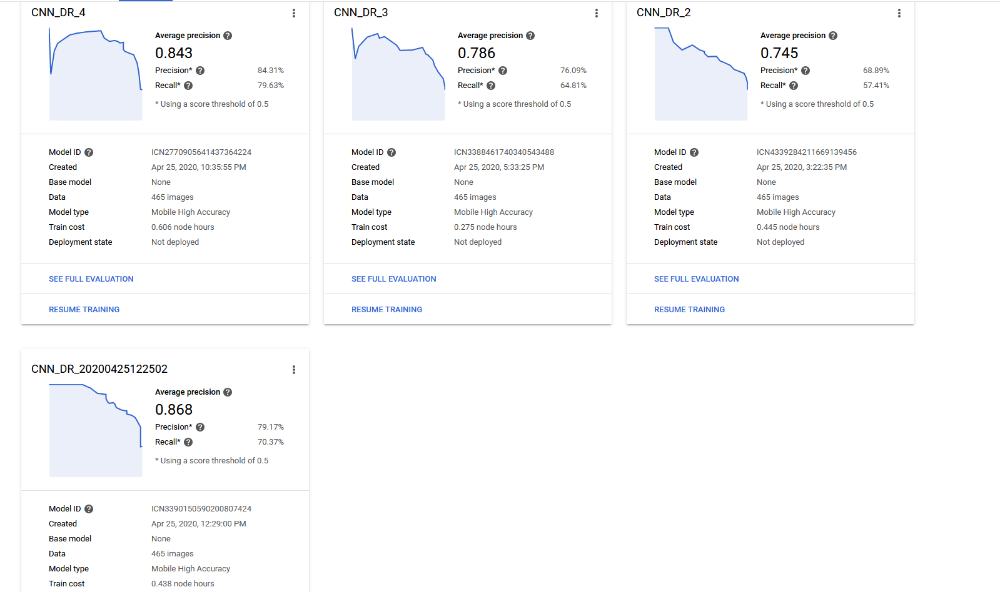
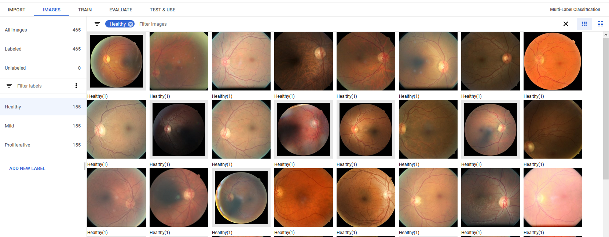
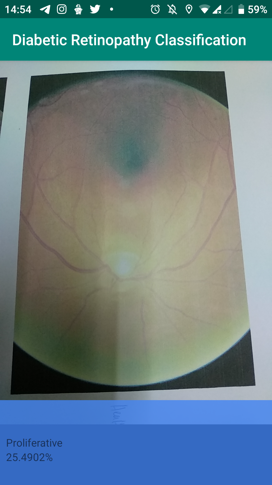
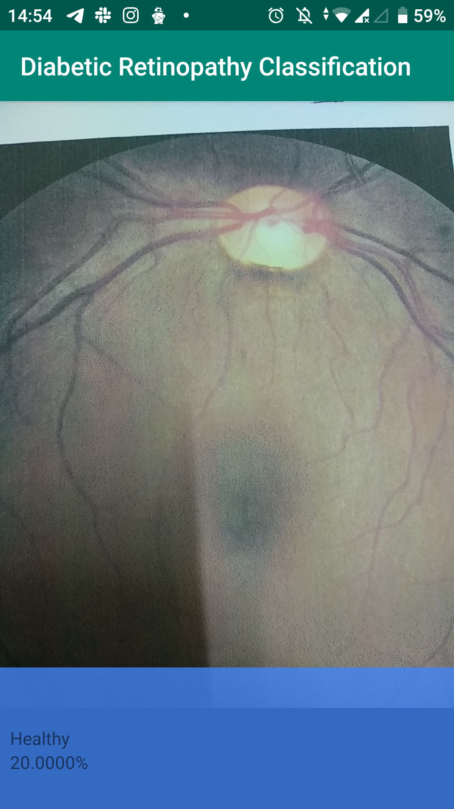

# DSCHackathonSolution
This repo is intended for the submission of the DCSKita Hack 2020 hackathon. The Android app is about mobile classifier, on the Edge inference of the Diabetic Retinopathy, which is a disease where the blood vessels of the patient experiencing swollen
and if the diagnosis is not conducted earlier, the fluid inside the blood vessel might be exposed inside the retina which can led to permanent blidness to the patient.

The Android app is the same implementation of the Cats Vs Dog classifier made by Google, but using with difference TF Lite model. Knowing that the team has limited hardware resources in the compute power department,
we decide to use AutoML Vision API, which is one of the services by Google Cloud Platform to train our own image classifier. During this period of 2 days hackathon, our team managed to train our images on the Google's TPU pod for faster results.
In a just few hours of off-site training--depending on the the training node selected, we gained some of the best Accuracy results as below

We belive Google can give us the state-of-the-art graph as we also believe Google can design to us the best suitable architecture for this use case.
# Aim

The aim of this project is to provide the fastest and easy ways for Ophthalmologist to reading patient's retina condition. In the previous method applied, Ophthalmologist need to analyze the patient's image one by one and as details as it can be in order
to decide either the patients is Healthy or alreadt in the critical stage of diabetic. With the aid of Computer Vision, we aim to provide the best solution as is to accelerate the diagnosis of the patient having blurry visions (signs of diabetic retinopathy),
thus accelerate the treatment needed for the patient including the Insulin treatment.

# Methodology

A total of 465 images(courtesy of Kaggle's Diabetic Retinopathy Competition "https://www.kaggle.com/c/diabetic-retinopathy-detection/data") consisting of 155 of images from 3 difference classes, Healthy, Mild, and Proliferative each are ingested into Cloud AutoML Vision platform for manual human classification (Supervised Learning). Cloud AutoML is a great place to sort out all
the images into the classes.

The image were then be given labels in the console, as exactly as the same label provided by the Ophthalmologist. In a Supervised Learning method, an images must be label before being fed into the training.

# Results

A couple of testing was held on Xiaomi Mi A1, and the results are pretty impressive, though an improvement shall be made in the future.

   
